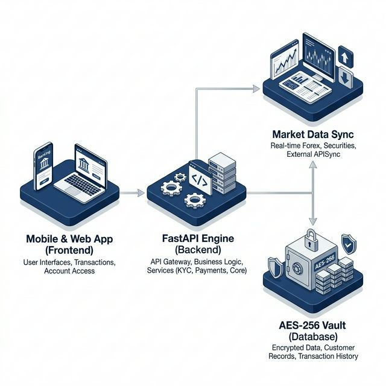

# ÖZAS Digital Banking System

## Introduction
Designed as a simulation of a Next-Gen Fintech Bank for the International Trade and Business core assignment. Operating under a backend-served Modular Monolith architecture, our app features an algorithmic append-only ledger constraint, enforcing absolute single-source truth balances.

### High-Security System Architecture

## Financial Data Transfer & Protocol Awareness
Real-world enterprise financial systems fundamentally operate on inter-connected banking rails utilizing highly strict communication standards like **ISO 20022, SWIFT, EMV, and Open Banking APIs**. These frameworks ensure security, atomicity, and mutual understanding across different sovereign banking engines around the globe.

Our platform operates conceptually as an external-facing digital interface that mimics these complex mechanisms through modernized **REST / JSON APIs**. For instance:
- **ISO 20022 & SWIFT Mapping:** When our platform handles internal/external `/transfer` operations using JSON structures (defining an account sender, receiver, and exact numerical payload), it conceptually acts as a high-level wrapper that a real banking gateway would down-translate into traditional XML-based `pacs.008` (Customer Credit Transfer) SWIFT/ISO 20022 messaging.
- **REST vs Event Processing:** Our monolithic REST layout abstracts real-world asynchronous operations. While we send an `execute_spot_trade` JSON body instantly resolving the balance in the `local_db`, real systems would stream this via message brokers (e.g., Apache Kafka) communicating with upstream Liquidity Providers and Clearing Houses adhering to EMV and SWIFT standardizations. Our REST architecture replicates the *endpoints* of an Open Banking API compliant node.

## Quick Start (Docker Compose)
1. Environment Configuration: Use the provided `.env.example` to generate your `.env`.
2. Architecture Compilation: Run `docker compose -f infra/docker-compose.yml up --build`
3. Visit `http://localhost:8000` or `http://localhost:8000/docs` for API details.
